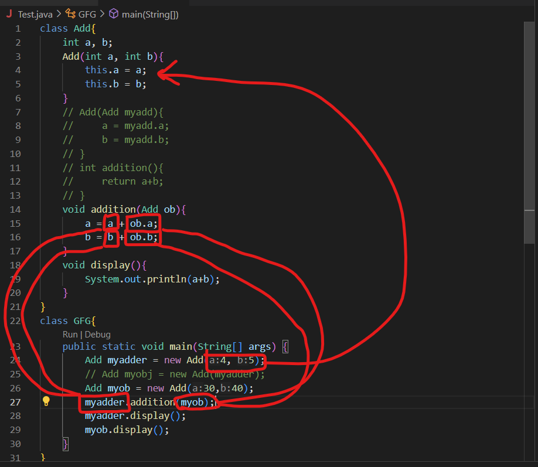
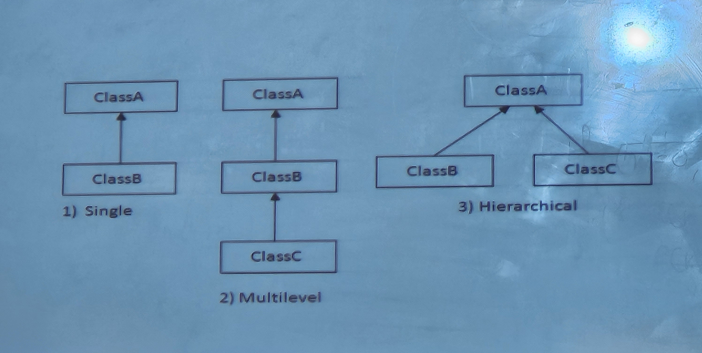

# JAVA NOTES
## WHAT IS JAVA ?
Java is a <mark> programming language and a platform.</mark> Java is a high level, robust, object-oriented and secure programming language.

Before Java, its name was Oak. 
Since Oak was already a registered company, so James Gosling and his team changed the name from Oak to Java.

**Platform:** Any hardware or software environment in which a program runs, is known as a platform. Since Java has a runtime environment (JRE) and API, it is called a platform

## FEATURES OF JAVA
1. Simple
2. Object-Oriented
3. Portable
4. Platform independent
5. Secured
6. Robust
7. Architecture neutral
8. Interpreted
9. High Performance
10. Multithreaded
11. Distributed
12. Dynamic

## [OOPs](README.md#pillars-of-oops)
Basic concepts of OOPs are:
1. Object
2. Class
3. Inheritance
4. Polymorphism
5. Abstraction
6. Encapsulation

**NOTE** - JAVA IS BOTH INTERPRETED AND COMPILED..

    SOURCE CODE --> compiler --> Byte Code
                                           ⬇️
    MACHINE CODE  <--   interepreter   <--

## Disadvantages of OOP
1. The length of the programmes developed using OOP language is much larger than the procedural approach. Since the programme becomes larger in size, it requires more time to be executed that leads to slower execution of the programme.
2. We can not apply OOP everywhere as it is not a universal 
language. It is applied only when it is required. It is not suitable for all types of problems.
3. Programmers need to have brilliant designing skill and 
programming skill along with proper planning because using OOP is little bit tricky.
4. OOPs take time to get used to it. The thought process involved in object-oriented programming may not be natural for some people.
5. Everything is treated as object in OOP so before applying it we need to have excellent thinking in terms of objects.

## Advantages of OOP
1. OOP is faster and easier to execute.
2. OOP provides a clear structure for the programs.
3. OOP helps to keep the Java code DRY "Don't Repeat Yourself", and makes the code easier to maintain, modify and debug.
4. OOP makes it possible to create full reusable applications with less code and shorter development time.

## Interpreter vs Compiler
    -The interpreter scans the program|the compiler scans the 
    line by line and translates it    |entire program first 
    into machine code                 |and then translates it
                                      |into machine code
    The interpreter shows one error   |the compiler 
                                      |shows all errors and |warnings at the same time
     at a time 

## CONSTRUCTOR
It is a block of code similar to method which creates values at the time of object creation
### There are 2 types of constructors : 
1. default (no argument) 
2. parameterized
### Rules for creating a constructor:
1. Constructor name must be same as the name of class
2. A constructor must not have an explicit return type
3. A java constructor cannot be static, final, abstract or synchronized
4. We can use access modifiers (private, public, protected or default) hwile declaring a constructor
### Syntax of default constructor :
    class_name(){}
### <mark> Why use parameterized constructor ? </mark>
#### Answer :
    parameterized constructor is used to provide different values to distinct objects. However, you can give the same values also.

### Sample Code :
    class Bank{
    String name, AccountType; //Instance variable
    int number, balance;
        Bank(int num, int Balance){
            name = "Daksh";
            AccountType = "Savings";
            number = num;
            balance = Balance; 
            System.out.println(num + " " + Balance);
        }
        public static void main(String[] args){
            Bank w = new Bank(123456789, 999);
            Bank d = new Bank(123456789, 100000000);
        }
    }
## Difference between constructor and method

### 25 August 2023
## Method Overloading
If a class has multiple methods having the same name but different parameters it is known as **Method Overloading.**
### Different ways to overload a method :
1. By changing the number of arguments.

1. By changing the data type.

### Sample Code :
    // (1) By changing number of Arguments
    class Adder{
        static int add(int a, int b){
            return a+b;
        }
        static int add(int a, int b, int c){
            return a+b+c;
        }
    }
    class TestOverloading{
        psvm(){
            System.out.println(Adder.add(11,11));
            System.out.println(Adder.add(11,1,1));
        }
    }

    // (2) changing the data type of arguments

    class Adder{
        static int add(int a, int b){
            return a+b;
        }
        static int add(double a, double b){
            return a+b;
        }
    }
    class TestOverloading{
        psvm(){
            System.out.println(Adder.add(11,11));
            System.out.println(Adder.add(11.2, 12.3));
        }
    }
### 28 August 2023 
### Can we overload main( ) method in Java ?
yes , we can have any number of main methods by method overloading but jvm calls only methods with string args only...  

SAMPLE CODE :

    class TstOvrloading{
        public static void main(String args[]){
            sout(from string[] args);
        }
        public static void main(String args){
            sout(from string args);
        }
        public static void main(String[]){
            sout(from string);
        }
    }

## [Pillars of OOPs](#oops)

## STATIC KEYWORD
The static keyword is used for memory management mainly. We can apply static keyword with variables, methods, blocks and nested classes.  
The static can be :
- Variable(AKA class variable)
- Method(AKA class method)

### Sample Code :

    class Student{
        int rollno; //instance variable
        String name;
        static String college = "ITS";
        Student(int r, String n){
            rollno = r;
            name = n;
        }
        void display(){System.out.println(rollno+" "+name+" "+ college);}
    }
    public class Test{
        psvm(){
            Student s1= new Student(111, "Aryan");
            s1.display();
        }
    }

### Sample Code :
    class counter{
        int count = 0;
        counter(){
            count ++;
            System.out.println(count);
        }
        psvm(){
            counter c1 = new counter();
            counter c2 = new counter();
            counter c3 = new counter();
        }
    }
<mark>; OUTPUT : 1 1 1 ;

    class counter{
        static int count = 0;
        counter(){
            count ++;
            System.out.println(count);
        }
        psvm(){
            counter c1 = new counter();
            counter c2 = new counter();
            counter c3 = new counter();
        }
    }
<mark>; OUTPUT : 1 2 3 ;

### STATIC METHODS :

### Sample Code :

    class Student{
        int rollno; //instance variable
        String name;
        static String college = "ITS";
        Student(int r, int n){
            rollno = r;
            name = n;
        }
        static void change(){
            college = "BBDOT";
        }
        void display(){System.out.println(rollno+" "+name+" "+ college);}
    }
    public class Test{
        psvm(){
            Student s1= new Student(111, "Aryan");
            s1.display();
        }
    }

## FINAL KEYWORD
The final keyword is used to restrict user from changing the value of that variable ( , method or class).

A final variable that is not initialized at the time of declaration is known as blank final variable.

## THIS KEYWORD

### Sample Code :
    class Student{
        int rollno; //instance variable
        String name;
        float fee;
        Student(int rollno, String name, float fee){
            rollno = rollno;
            name = name;
            fee = fee;
        }
        void display(){System.out.println(rollno+" "+name+" "+ fee);}
    }
    public class Test{
        psvm(){
            Student s1= new Student(111, "Aryan", 60000f);
            s1.display();
        }
    }

<mark> ; OUTPUT : error in thread ;

        class Student{
        int rollno; //instance variable
        String name;
        float fee;
        Student(int rollno, String name, float fee){
            this.rollno = rollno;
            this.name = name;
            this.fee = fee;
        }
        void display(){System.out.println(rollno+" "+name+" "+ fee);}
    }
    public class Test{
        psvm(){
            Student s1= new Student(111, "Aryan", 60000f);
            s1.display();
        }
    }

NOTE : this variable can be read as an object,  
for example : this.rollno is read as s1.rollno

<mark> ; NEW OUTPUT : 111 Aryan 60000

### Sample Code : 
    class st{
        int a, b;
        st(st t1){
            a = t1.a;
            b = t1.b;
        }
        st(int m, int n){
            a = m;
            b = n;
        }
        void add(){
            System.out.println(a+b);
        }
        public static void main(String args[]){
            st ob1 = new st(20,40);
            st ob2 = new st(ob1);
            ob2.add();
        }
    }

<mark> : OUPUT : pata nahi ;) .

## Passing objects as parameters

### Sample Code : 
    class Box{
        double width, height, depth;
        Box(Box ob){
            width = ob.width;
            height = ob.height;
            depth = ob.depth;
        }
        Box(double w, double h, double d){
            width = w;
            height = h;
            depth = d;
        }
        double volume(){return width*height*depth;}
    }
    public class GFG{
        public static void main(String[] args){
            Box mybox = new Box(10,20,15);
            Box myclone = new Box(mybox);
            double vol;
            vol = mybox.volume();
            System.out.println("Volume of mybox is: " + vol);
            vol = myclone.volume();
            System.out.println("Volume of myclone is: " + vol);
        }
    }

    class Add{
        int a, b;
        Add(int a, int b){
            this.a = a;
            this.b = b;
        }
        // Add(Add myadd){
        //     a = myadd.a;
        //     b = myadd.b;
        // }
        // int addition(){
        //     return a+b;
        // }
        void addition(Add ob){
            a = a + ob.a;
            b = b + ob.b;
        }
        void display(){
            System.out.println(a+b);
        }
    }
    class GFG{
        public static void main(String[] args) {
            Add myadder = new Add(4, 5);
            // Add myobj = new Add(myadder);
            Add myob = new Add(30,40);
            myadder.addition(myob);
            myadder.display();
            myob.display();
        }
    }

## ARRAYS
**Definition : An array is a collection of similar types of objects**
### SYNTAX TO DECLARE AN ARRAY
* dataType[ ] arr ;
* dataType arr[ ] ;

**Declaration & Instantiation: int arr[ ] = new int[5]**  

**Declaration, instantiation and initialization : int arr[] = {33, 3, 4, 5}**

### Sample Code : 
    // WAP to calculate min element of array
    public class Test{
    static void minArray(int[] arr){
        int min = arr[0];
        for(int i=0; i<5; i++){
            if(min>arr[i]){
                min = arr[i];
            }
        }
        System.out.println(min);
    }
    public static void main(String[] args) {
        int[] arr = {33, 4, 5,6,7};
        minArray(arr);
    }
}

## INHERITANCE
### Inheriting properties and behaviours of parent class is known as inheritance

### Sample Code :   
    class Employee{
        int salary = 20000000;
    }
    class Programmer extends Employee{
        int bonus = 200;
        psvm(){
            Programmer p = new Programmer();
            System.out.println(p.salary);
            System.out.println(p.bonus);
        }
    }

### Why use inheritance ?
- For **method OVERRIDING** (so **RUNTIME polymorphism** can be achieved)
- For code reusability

## Terms used in inheritance : 
- Class : a class is a group of objects sharing same properties and behaviours.
- Sub class : It is a child class which inherits the other class. It is also called a derived class, extended or a child class.
- Superclass: A super class is the class from where the child class inherits all its properties.It is also called parent class or base class.
- Reusability: 

## EXTENDS KEYWORD :  
the extends keyword indicates that you are making a new class that derives from an existing class. The meaning of "extends" is to increase functionality.

### JAVA SUPPORTS 3 TYPES OF INHERITANCE
- Single
- Multilevel 
- Hierarichal
- Multiple (Does not natively support it, but we can achieve it using interface)
- Hybrid (Not supported by java)

### Sample Code :
    import java.util.Scanner;
    class Area{
        Scanner sc = new Scanner(System.in);
        int a,b,ar;
        int area(){
            System.out.print("Enter length and breadth of a rectangle: ");
            a = sc.nextInt();
            b=  sc.nextInt();
            ar = a*b;
            return ar;
        }
    }
    class Volume extends Area{
        int volume(){
            int h, vol;
            System.out.print("Enter length, breadth and depth of a cuboid: ");
            h = sc.nextInt(); 
            vol = ar*h
            return x*y*z;
        }
    }
    class Both{
        public static void main(String[] args){
            Both b = new Both();
            
        }
    }
        

### Sample Code : 
    class School{
        static String S_name;
    }

    class Room extends School{
        static String section;
    }

    class Student extends Room{
        static String St_name;
        public static void main(String[] args) {
            S_name = "MUJ";
            section = "J";
            St_name = "Daksh";
            System.out.println(S_name+" "+section+" "+St_name);
        }
    }

## SUPER KEYWORD

**We can use super keyword to access the data member or field of parent class> It is used if parent class and child class have same fields**

### Sample Code : 
    class A{
        int x = 10;
        void display(){
            System.out.println(x);
        }
    }
    class B extends A{
        int x = 20;
        void display(){
            System.out.println(x);
            super.display();
        }
    }
    class C extends B{
        public static void main(String[] args){
            B ob1 = new B();
            ob1.display();
        }
    }
    
### Sample Code : 
    class A{
        int x=20;
        A(int a){
            x = a;
        }
        void display(){
            System.out.println(x);
        }
    }
    class B extends A{
        int x;
        B(int x){
            super(x);
            this.x = x;
        }
        void display(){
            System.out.println(x);
            super.display();
        }
    }
    class C{
        public static void main(String[] args){
            B ob1 = new B(10);
            ob1.display();
        }
    }

## DYNAMIC ARRAYS
<code>scdcdcj</code>
### Sample Code :
    import java.util.*;

    class Addmethod{
        public static void main(String[] args){
            ArrayList<integer> arr = new ArrayList<>;
            arr.add(3);
            System.out.print("Before inserting: "+arr);
            arr.add(2,3);
            System.out.print("After inserting: " + arr);
        }
    }

    .---------------------------------------.
    |     |Default|Private|Protected|Public |
    +----+--------+--------+-------+--------+
    |  1 |        |        |       |        |
    |  2 |        |        |       |        |
    |  3 |        |        |       |        |
    |  4 |        |        |       |        |
    |  5 |        |        |       |        |
    '----+--------+--------+-------+--------.

### COMMAND LINE ARGUMENTS

ho gya bas
**Command**
    javac test.java
    java test "Your string"

## STRINGS

- **String Literal :** Each time we create a string literal the JVM checks the <code>"string constant pool"</code> first. If the string already exists in the pool, a reference to the pooled instance is returned.

- **By new keyword :** String s = new String("Hello World");

**NOTE !**  
**In java String objects are immutable.**
Example :

    class Cricket{
        public static void main(String args[]){
            String s = "Sachin";
            s.concat(" Tendulkar");
            System.out.println(s);
        }
    }

**Output :** Sachin 

**Correct use :**

    class Cricket{
        public static void main(String args[]){
            String s = "Sachin";
            s = s.concat(" Tendulkar");
            System.out.println(s);
        }
    }

### Methods :

**Comparing 2 strings**
- equals()
- == operator
- CompareTo()

----  

    class Cricket{
        public static void main(String args[]){
            String s = "Sachin";
            String s2 = "Sachin";
            String s3 = "Sourav";
            System.out.println(s1.equals(s2)); //True
            System.out.println(s1.equals(s3)); //False
        }
    }
---
    class Cricket{
        public static void main(String args[]){
            String s = "Sachin";
            String s2 = "Sachin";
            String s3 = new String("Sourav");
            System.out.println(s1 == s2); //True because both are created in the same pool
            System.out.println(s2 == s3); //False because s3 refers to the instance created in another pool
        }
    }
---
    class Cricket{
        public static void main(String args[]){
            String s = "Sachin";
            String s2 = "Sachin";
            String s3 = new String("Sourav");
            System.out.println(s1.CompareTo(s2)); // 0 Because they have the same lexicographic order
            System.out.println(s2.CompareTo(s3)); // -1 Because s2<s3
        }
    }
---

    class Cricket{
        public static void main(String args[]){
            String s = 30+50+"Sachin"+40+40;
            System.out.println(s);
            // Output : 80Sachin4040
        }
    }
---

    class Cricket{
        public static void main(String args[]){
            String s = "Hello";
            System.out.println(s.substring(0,2));
            // Output : He
        }
    }
---
### Note : 
---
**substring(beginIndex)**  
**substring(beginIndex, endIndex)**

---

    class Cricket{
        public static void main(String args[]){
            String s = "Hello";
            System.out.println(s.startswith("He"));
            // Output : True
        }
    }
---
    class Cricket{
        public static void main(String args[]){
            String s = "Hello";
            System.out.println(s.charAt(2));
            // Output : l
        }
    }

## INTERFACE

### Sample Code: 
    interface printable{
        void print();
    }
    class Ag implements printable{
        public void print(){
            System.out.println("HEllo");
        }
        public static void main(String[] args) {
            Ag ob = new Ag();
            ob.print();
        }
    }
---

    interface printable1{
        void print();
    }
    interface printable2 extends printable1{
        void print2();
    }
    class call implements printable2{
        public void print(){
            System.out.println("Hello");
        }
        public void print2(){
            System.out.println("World");
        }
        public static void main(String[] args) {
            call ob = new call();
            ob.print();
            ob.print2();
        }
    }

---
    interface Drawable{
        void draw();
    }

    class Circle implements Drawable{
        public void draw(){
            System.out.println("Draw Circle !");
        }
    }

    class Rectangle implements Drawable {
        public void draw(){
            System.out.println("Draw Rectangle !");
        }
    }

    class Testclass{
        public static void main(String[] args) {
            Drawable cd = new Circle();
            Drawable rd = new Rectangle();
            Circle c = new Circle();
            Rectangle r = new Rectangle();
            cd.draw();
            rd.draw();
            c.draw();
            r.draw();
            cd = new Rectangle();
            cd.draw();
        }
    }