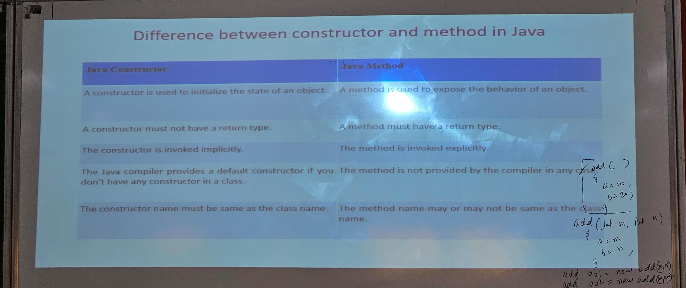

# JAVA NOTES
## CONSTRUCTOR
It is a block of code similar to method which creates values at the time of object creation
### There are 2 types of constructors : 
1. default (no argument) 
2. parameterized
### Rules for creating a constructor:
1. Constructor name must be same as the name of class
2. A constructor must not have an explicit return type
3. A java constructor cannot be static, final, abstract or synchronized
4. We can use access modifiers (private, public, protected or default) hwile declaring a constructor
### Synatx of default constructor :
    class_name(){}
### <mark> Why use parameterized constructor ? </mark>
#### Answer :
    parameterized constructor is used to provide different values to distinct objects. However, you can give the same values also.

### Sample Code :
    class Bank{
    String name, AccountType;
    int number, balance;
        Bank(int num, int Balance){
            name = "Daksh";
            AccountType = "Savings";
            number = num;
            balance = Balance; 
            System.out.println(num + " " + Balance);
        }
        public static void main(String[] args){
            Bank w = new Bank(123456789, 999);
            Bank d = new Bank(123456789, 100000000);
        }
    }
## Difference between constructor and method

